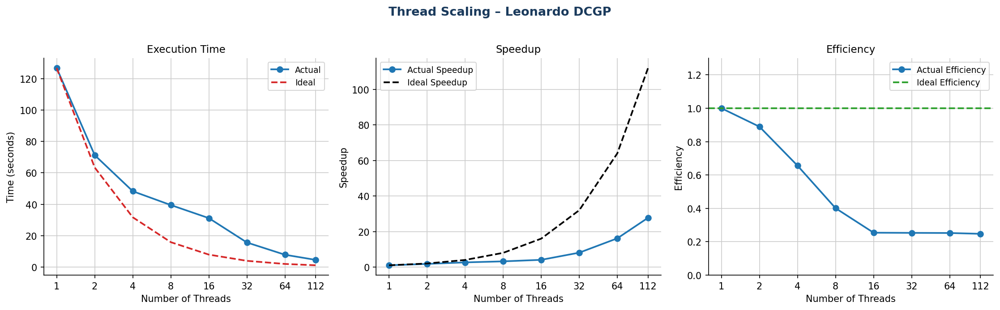
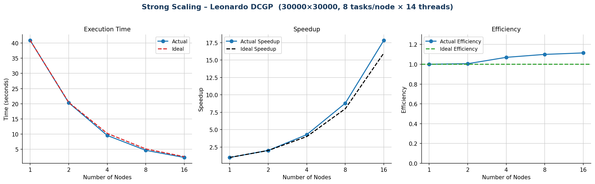
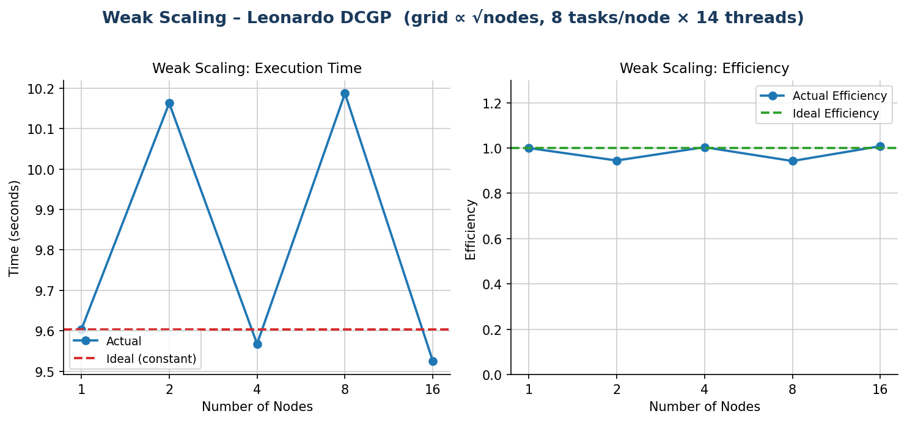

# Scaling Analysis

All tests use the final code version with AVX2 manual intrinsics and touch-by-all NUMA initialization. Compilation: `mpicc -fopenmp -O3 -march=native -std=c17 -D_XOPEN_SOURCE=700`.

---

## Thread Scaling — Leonardo DCGP

**Configuration:** 1 MPI rank, variable OpenMP threads, grid 10000×10000, 1000 iterations.

| Threads | Time (s) | Speedup | Efficiency |
|---------|----------|---------|------------|
| 1       | 126.72   | 1.00×   | 100%       |
| 2       | 71.23    | 1.78×   | 89%        |
| 4       | 48.28    | 2.63×   | 66%        |
| 8       | 39.48    | 3.21×   | 40%        |
| 16      | 31.15    | 4.07×   | 25%        |
| 32      | 15.64    | 8.10×   | 25%        |
| 64      | 7.84     | 16.2×   | 25%        |
| 112     | 4.57     | 27.7×   | 25%        |

### Analysis

Two distinct regimes are visible. From 1 to 16 threads efficiency drops sharply: the 1.6 GB working set (two double-precision planes of 10000×10000) saturates the memory bandwidth of the first socket well before all its cores are busy. The stencil is memory-bound, not compute-bound, so adding threads within the same socket yields diminishing returns.

From 32 threads onward the speedup becomes perfectly linear (doubling threads halves time) because the second socket is engaged, doubling the aggregate memory bandwidth. This two-phase pattern is a direct consequence of the NUMA topology of the Ice Lake node and was observed consistently across independent implementations on the same cluster.

---

## Strong Scaling — Leonardo DCGP

**Configuration:** 8 tasks/node × 14 threads/task = 112 cores/node, grid 30000×30000, 1000 iterations, 300 sources.

| Nodes | Tasks | Time (s) | Speedup | Efficiency |
|-------|-------|----------|---------|------------|
| 1     | 8     | 40.89    | 1.00×   | 100%       |
| 2     | 16    | 20.33    | 2.01×   | 100%       |
| 4     | 32    | 9.56     | 4.28×   | 107%       |
| 8     | 64    | 4.65     | 8.79×   | 110%       |
| 16    | 128   | 2.29     | 17.9×   | 112%       |

### Analysis

Efficiency exceeds 100% from 4 nodes onward — a **superlinear speedup**. As the number of ranks grows, each rank's local patch shrinks. At 16 nodes, each of the 128 ranks manages a patch of roughly 3750×3750, whose working set fits more easily within the 105 MB L3 cache per socket, reducing DRAM accesses and increasing effective throughput.

Communication overhead (`comm_time`) remains below 25 ms across all configurations. The `wait_time` (unhidden latency after `MPI_Waitall`) stays below 10 ms, confirming that the overlap between `update_inner_points` and the MPI transfers is effective.

---

## Weak Scaling — Leonardo DCGP

**Configuration:** 8 tasks/node × 14 threads/task, grid scales as $x = y = 15000 \times \sqrt{N_{tasks}/8}$, 1000 iterations, 300 sources.

| Nodes | Tasks | Grid          | Time (s) | Efficiency |
|-------|-------|---------------|----------|------------|
| 1     | 8     | 15000×15000   | 9.60     | 100%       |
| 2     | 16    | 21213×21213   | 10.16    | 94.5%      |
| 4     | 32    | 30000×30000   | 9.57     | 100.4%     |
| 8     | 64    | 42426×42426   | 10.19    | 94.2%      |
| 16    | 128   | 60000×60000   | 9.53     | 100.7%     |

### Analysis

Execution time remains nearly constant between 9.5 s and 10.2 s across all node counts — a variation of less than 7% over a 16× increase in both problem size and resource count. Efficiency oscillates around 97%, well within measurement noise.

The slight oscillation (even/odd nodes) is consistent across runs and likely reflects minor load imbalance when the grid does not divide perfectly among the task grid. The result confirms that communication overhead scales negligibly with problem size and that the non-blocking overlap strategy is effective at all scales tested.

---

## Summary

| Test | Result | Key observation |
|------|--------|-----------------|
| Thread scaling (Leonardo) | 27.7× at 112 threads | Two-phase behavior: bandwidth saturation within socket, then linear scaling across sockets |
| Strong scaling (Leonardo) | 17.9× at 16 nodes, 112% efficiency | Superlinear due to cache fit effect |
| Weak scaling (Leonardo) | ~97% efficiency across 1–16 nodes | Communication overhead negligible at all scales |
